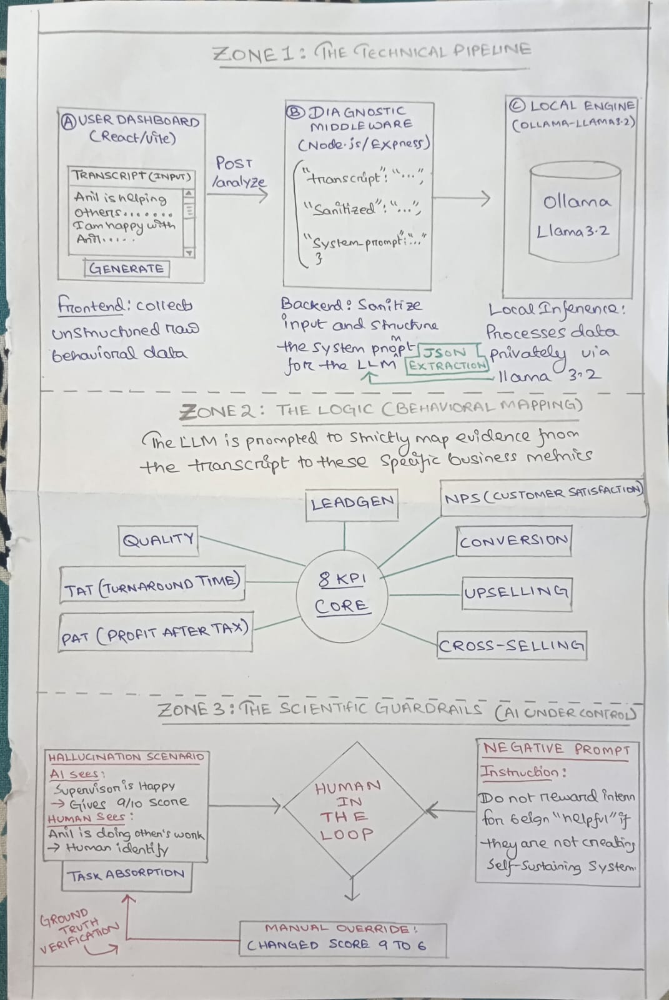

# Trinethra | AI-Assisted Behavioral Mapping Engine

**Trinethra** is a specialized diagnostic tool designed to analyze supervisor feedback and map it to 8 core business KPIs. By integrating a local **Llama 3.2** instance, the system provides high-fidelity performance reviews while ensuring 100% data privacy—a critical requirement for MSME and factory environments.

## 🚀 Key Features

* **Local LLM Inference**: Powered by **Ollama (Llama 3.2 2B)** to eliminate data latency and ensure sensitive factory transcripts never leave the local machine.
* **KPI-Driven Analysis**: Automatically extracts behavioral evidence for Lead Gen, Conversion, Upselling, Cross-selling, NPS, PAT, TAT, and Quality.
* **Hallucination Control**: Features a "Human-in-the-Loop" scoring system specifically prompted to distinguish between **"Task Absorption"** (performing others' work) and **"Systems Building"** (creating sustainable processes).
* **Full-Stack Pipeline**: A responsive **React** (Vite) frontend communicating with a **Node.js/Express** backend.

## 🛠️ Tech Stack

* **Frontend**: React.js, Tailwind CSS
* **Backend**: Node.js, Express.js
* **AI Engine**: Ollama (Llama 3.2 2B)
* **Protocol**: REST API (JSON)

## 📊 System Architecture



## 🧠 Scientific Execution & Hallucination Guardrails

During development, the **"Anil Menon"** test case revealed that the LLM initially hallucinated a high score (9/10) due to the supervisor's glowing praise. 

**The Solution:**
1. **Prompt Refinement**: The system prompt was updated with **Negative Prompting** to penalize "helpful" behaviors that do not result in self-sustaining systems.
2. **Human-in-the-Loop Override**: The UI allows developers/reviewers to manually adjust scores (e.g., from 9 down to 6) based on evidence of task absorption versus actual systems-level leadership.

## 🛠️ Setup Instructions

1. **Clone the Repo**:
   ```bash
   git clone [https://github.com/DKS96685/Local-LLM-integration-and-Behavioral-Mapping.git](https://github.com/DKS96685/Local-LLM-integration-and-Behavioral-Mapping.git)
